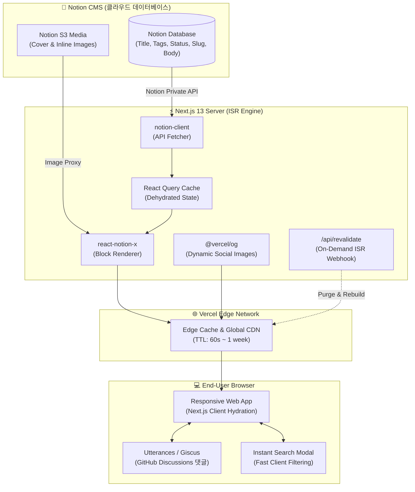

<div align="center">

# 🚀 백경환의 T4 Tech Blog (`notion-blog`)

<p align="center">
  <strong>Notion을 헤드리스 CMS로 활용하는 초고속 정적 기술 블로그 & 디지털 아카이브</strong>
</p>

<p align="center">
  
  
  
  
  
  
  
  
</p>

<p align="center">
  <a href="#-프로젝트-개요">프로젝트 개요</a> •
  <a href="#-핵심-특징">핵심 특징</a> •
  <a href="#-시스템-아키텍처">아키텍처</a> •
  <a href="#-만들-것들--개발-로드맵-roadmap">만들 것들 (로드맵)</a> •
  <a href="#-디렉터리-구조">프로젝트 구조</a> •
  <a href="#-빠른-시작-getting-started">시작하기</a> •
  <a href="#-노션-연동-가이드">노션 연동 가이드</a>
</p>

<br/>


</div>

<br/>

---

## 📖 프로젝트 개요

**`백경환의 T4 (notion-blog)`**는 개인 생산성 도구인 **Notion(노션)**을 강력한 헤드리스 CMS(Headless Content Management System)로 활용하여, 글 작성부터 웹 배포까지의 모든 과정을 혁신한 차세대 엔지니어링 블로그입니다.

기존 정적 블로그(Jekyll, Hugo, Gatsby 등)처럼 마크다운 파일을 로컬에서 작성하고 Git 커밋/푸시 및 긴 빌드 시간을 기다릴 필요 없이, **노션 앱에서 글을 작성하고 `Public` 상태로 변경하는 즉시** Next.js의 **ISR(증분 정적 재생성)** 엔진을 통해 브라우저에 실시간 반영됩니다.

- ✍️ **작성자 경험(DX)**: 노션의 풍부한 블록 에디터(수식, 코드, 이미지, 콜아웃, 토글) 그대로 집필
- ⚡ **독자 경험(UX)**: 사전 렌더링된 정적 HTML + Vercel Edge CDN을 통한 0초대 번개 로딩
- 🤖 **생태계 연계**: [Portal Hub](https://bkh-sss.github.io/portal-hub/) 및 [Skadi Discord Bot](https://github.com/BKH-sss/skadi-discord-bot)과 유기적으로 연동되는 통합 기술 아카이브

---

## ✨ 핵심 특징

| 특징 | 설명 |
| :--- | :--- |
| **🚀 Zero-Commit Publishing** | 깃허브 커밋이나 빌드 없이 노션 데이터베이스에서 글 상태 변경만으로 즉시 웹사이트 발행 |
| **⚡ Next.js ISR 초고속 로딩** | 정적 사이트(SSG)의 압도적인 로딩 속도와 동적 사이트(SSR)의 실시간성을 결합한 하이브리드 아키텍처 |
| **🌓 Modern Glassmorphism & Themes** | 시스템 설정 자동 감지, 다크 모드, 라이트 모드를 부드럽게 지원하는 모던 UI |
| **💻 풍부한 개발자 블록** | PrismJS 코드 하이라이팅, 원클릭 코드 복사, KaTeX 수식, Mermaid 다이어그램 기본 렌더링 |
| **🎯 완벽한 SEO & 소셜 카드** | 동적 OpenGraph(OG) 썸네일 이미지 자동 생성, RSS 피드, `sitemap.xml` 자동 생성 |
| **📄 이력서 & 포트폴리오 뷰** | 일반 블로그 포스트뿐만 아니라 단일 풀페이지 형태의 인터랙티브 이력서(`/resume`) 지원 |

---

## 🏗️ 시스템 아키텍처



---

## 🎯 만들 것들 & 개발 로드맵 (Roadmap)

> [!TIP]
> 앞으로 `notion-blog`에 구현하고 고도화할 기능들을 우선순위별로 체계화한 로드맵입니다.

### 🚀 Phase 1: 노션 CMS 엔진 & 블록 렌더링 고도화 (Core Engine)
- [x] **Notion Database 기본 연동**: `site.config.js`를 통한 `NOTION_PAGE_ID` 바인딩
- [ ] **[P0] 온디맨드 재검증 웹훅 (`/api/revalidate`)**: 노션 내용 수정 시 자동 트리거되어 0초 만에 캐시 갱신
- [ ] **[P1] 코드 블록 기능 혁신**:
  - [ ] 코드 블록 상단 파일명 탭 및 언어 배지 표시
  - [ ] 원클릭 '복사 완료(Copied!)' 인터랙티브 툴팁
  - [ ] 코드 라인 넘버링(Line Numbers) 및 특정 라인 강조(Highlight Lines)
- [ ] **[P1] 고급 블록 렌더링 지원**:
  - [ ] KaTeX 수식 블록 ($$LaTeX$$) 렌더링 최적화
  - [ ] Mermaid.js 아키텍처 다이어그램 인라인 렌더링
  - [ ] 콜아웃(Callout) 박스 커스텀 아이콘 및 배경 색상 정밀화
  - [ ] 토글(Accordion) 블록 부드러운 펼침/접힘 애니메이션
- [ ] **[P2] 노션 이미지 만료 방지 (AWS S3 / Cloudinary 영구 캐시 프록시)**: 노션 임시 이미지 URL 만료 문제 원천 차단

---

### 🎨 Phase 2: UI/UX & 독서 경험 극대화 (Design System)
- [ ] **[P0] 상단 독서 진행도 인디케이터 (Reading Progress Bar)**: 스크롤 깊이에 따라 헤더 하단에 스무스 프로그레스 바 표시
- [ ] **[P0] 우측 플로팅 목차 (Sticky Table of Contents - TOC)**:
  - [ ] 현재 읽고 있는 헤딩(H1, H2, H3) 하이라이트 감지 (Intersection Observer)
  - [ ] 클릭 시 해당 섹션으로 부드러운 스무스 스크롤 이동
- [ ] **[P1] 피드 레이아웃 뷰 스위처 (View Mode Switcher)**:
  - [ ] 🖼️ **갤러리 카드 뷰**: 썸네일 강조형 그리드 카드 레이아웃
  - [ ] 📋 **미니멀 리스트 뷰**: 빠른 탐색을 위한 텍스트 중심 컴팩트 레이아웃
- [ ] **[P1] 글 예상 독서 시간 (Reading Time)**: 본문 분량 분석 후 `⏱️ 5분 소요` 메타 정보 자동 표시
- [ ] **[P2] 테마 전환 효과 극대화**: 다크/라이트 모드 전환 시 부드러운 컬러 트랜지션 애니메이션

---

### 🔎 Phase 3: 검색 & 분류 아카이브 시스템 (Taxonomy & Search)
- [ ] **[P0] 즉시 검색 모달 (Command Palette `Cmd/Ctrl + K`)**:
  - [ ] 제목, 요약, 태그, 본문 키워드를 초고속 클라이언트 인덱싱 검색
  - [ ] 키보드 화살표 키 및 Enter 키 이동 지원
- [ ] **[P1] 태그 & 카테고리 고도화**:
  - [ ] 다중 태그 교차 필터링
  - [ ] 태그별 포스트 개수 카운트 배지
- [ ] **[P1] 시리즈(연재물) 묶음 뷰 (`/series/[slug]`)**: 1편, 2편 등 순차 연재물을 한눈에 탐색하는 시리즈 뷰어
- [ ] **[P2] 타임라인 연도별/월별 아카이브 페이지 (`/archives`)**

---

### 💬 Phase 4: 인터랙션 & 커뮤니티 위젯 (Interactivity)
- [x] **Utterances GitHub 이슈 댓글 기본 연동**
- [ ] **[P0] Giscus(GitHub Discussions) 댓글 시스템 마이그레이션**:
  - [ ] 이모지 리액션(❤️, 👍, 🚀, 🎉) 지원
  - [ ] 다크/라이트 테마 자동 동기화
  - [ ] 답글 스레드 및 깃허브 계정 실시간 멘션
- [ ] **[P1] 포스트 감정 표현 & 박수(Clap) / 좋아요 위젯**:
  - [ ] 글 하단 인터랙티브 박수 버튼 (중복 탭 지원)
  - [ ] Upstash Serverless Redis 연동으로 실시간 카운트 저장
- [ ] **[P1] 실시간 조회수 카운터 (Page View Counter)**: 개별 글 상단에 실시간 누적 조회수 배지 표시
- [ ] **[P2] SNS 원클릭 공유 버튼 (X/트위터, 링크 복사, 카카오톡)**

---

### 📊 Phase 5: SEO, 소셜 최적화 & 애널리틱스 (Growth & SEO)
- [x] 기본 동적 OG Image 및 Sitemap 생성
- [ ] **[P0] `@vercel/og` 기반 초고화질 동적 소셜 썸네일**:
  - [ ] 글 제목, 작성자, 태그가 자동으로 새겨진 깔끔한 1200x630 배너 자동 렌더링
- [ ] **[P1] 검색 엔진 등록 최적화**:
  - [ ] Google Search Console 사이트 인증 및 색인 자동화
  - [ ] Naver Search Advisor 메타태그 및 `robots.txt` 최적화
- [ ] **[P2] 개인정보 보호 친화적 분석 도구 연동**:
  - [ ] Google Analytics 4 (GA4) 이벤트 추적
  - [ ] Vercel Analytics / Speed Insights 0-config 연동

---

### 🤖 Phase 6: BKH 통합 생태계 연계 (Ecosystem Integration)
- [ ] **[P1] Skadi Discord Bot 연동 위젯**:
  - [ ] 블로그 상단/사이드바에 Skadi AI 어시스턴트 프로필 배너 탑재
  - [ ] 신규 포스팅 작성 시 Skadi 봇을 통해 디스코드 채널로 자동 알림 웹훅 발송
- [ ] **[P1] Portal Hub (`portal-hub`) 상호 링크 위젯**:
  - [ ] [Portal Hub](https://bkh-sss.github.io/portal-hub/) 메인 헤더 및 배너와 블로그 상호 연결

---

### 🚢 Phase 7: CI/CD & DevOps 자동화
- [ ] **[P1] GitHub Actions 자동 린트 & 빌드 검증 파이프라인**: PR 및 push 시 ESLint, TypeScript 타입 체크 자동 수행
- [ ] **[P2] 깨진 링크 감지기 (Broken Link Checker)**: 외부 링크 및 이미지 깨짐 주 1회 자동 모니터링

---

## 📁 디렉터리 구조

```plaintext
notion-blog/
├── .github/                  # GitHub Actions 워크플로우 & 템플릿
├── public/                   # 정적 에셋 (파비콘, 기본 아바타, 로고 등)
├── src/
│   ├── apis/                 # Notion Client API 통신 & 데이터 패칭
│   ├── assets/               # 프로젝트 공통 이미지 & 폰트
│   ├── components/           # 재사용 가능한 UI 아토믹 컴포넌트
│   │   ├── MetaConfig.tsx    # SEO 메타태그 & OG 태그 주입기
│   │   └── ...
│   ├── constants/            # React Query 키 및 상수 정의
│   ├── hooks/                # 커스텀 리액트 훅 (테마, 스크롤, 미디어쿼리 등)
│   ├── layouts/              # 루트 레이아웃 (헤더, 푸터, 사이드바 구조)
│   │   └── RootLayout/
│   ├── libs/                 # 외부 라이브러리 설정 (react-query, notion utils)
│   ├── pages/                # Next.js Pages 라우터
│   │   ├── _app.tsx          # 글로벌 프로바이더 & 스타일 초기화
│   │   ├── _document.tsx     # HTML 헤드 & 폰트 로드
│   │   ├── 404.tsx           # 커스텀 404 에러 페이지
│   │   ├── [slug].tsx        # 개별 블로그 포스트 동적 라우트
│   │   ├── index.tsx         # 메인 피드 페이지
│   │   ├── sitemap.xml.tsx   # 동적 사이트맵 생성기
│   │   └── api/
│   │       └── revalidate.ts # 온디맨드 ISR 캐시 갱신 엔드포인트
│   ├── routes/               # 페이지별 뷰 레이어 (Feed, Detail 등)
│   ├── styles/               # Emotion 글로벌 스타일 & 테마 변수
│   └── types/                # TypeScript 전역 인터페이스 정의
├── next.config.js            # Next.js 빌드 및 이미지 도메인 설정
├── next-sitemap.config.js    # 사이트맵 생성 설정
├── package.json              # 패키지 매니페스트 & 스크립트
├── site.config.js            # ⭐ 블로그 전역 설정 (프로필, 노션 ID, 플러그인)
├── tsconfig.json             # TypeScript 컴파일러 설정
└── yarn.lock
```

---

## 🚀 빠른 시작 (Getting Started)

### 1. 사전 준비 (Prerequisites)
- [Node.js](https://nodejs.org/) v18.0.0 이상
- [Yarn](https://yarnpkg.com/) v1.22+ (`npm i -g yarn`)

### 2. 저장소 복제 및 의존성 설치
```bash
# 1. 저장소 클론
git clone https://github.com/BKH-sss/notion-blog.git
cd notion-blog

# 2. 패키지 설치
yarn install

# 3. 로컬 개발 서버 시작
yarn dev
```
브라우저에서 `http://localhost:3000`에 접속하여 블로그를 확인합니다.

---

## ⚙️ 설정 가이드 (`site.config.js`)

블로그의 모든 핵심 메타데이터는 프로젝트 루트의 `site.config.js` 파일 하나로 관리됩니다:

```javascript
const CONFIG = {
  profile: {
    name: "skadi",
    role: "Full-Stack Developer & AI Researcher",
    bio: "기술과 개발, 인공지능에 대한 탐구와 일상을 기록하는 공간입니다.",
    github: "BKH-sss",
    image: "/avatar.svg",
  },
  projects: [
    { name: "백경환의 T4", href: "https://github.com/BKH-sss/notion-blog" },
    { name: "Portal Hub", href: "https://bkh-sss.github.io/portal-hub/" },
    { name: "Skadi Bot", href: "https://github.com/BKH-sss/skadi-discord-bot" },
  ],
  blog: {
    title: "백경환의 T4",
    description: "기술과 인공지능, 개발 여정을 기록하는 T4 테크 블로그입니다.",
    scheme: "system", // 'light' | 'dark' | 'system'
  },
  notionConfig: {
    pageId: process.env.NOTION_PAGE_ID || "3ce70b4257868081972fc7fb429a6e88",
  },
  utterances: {
    enable: true,
    config: {
      repo: "BKH-sss/notion-blog",
      "issue-term": "og:title",
      label: "💬 Utterances",
    },
  },
  revalidateTime: 21600 * 7, // 재검증 주기 (초)
}
```

---

## 📝 노션 연동 가이드

### 1. 노션 데이터베이스 템플릿 복제
1. 공식 노션 템플릿 페이지에 접속합니다.
2. 우측 상단의 **`복제(Duplicate)`** 버튼을 클릭하여 본인의 노션 워크스페이스로 복사합니다.

### 2. 웹에 공유 (Share to Web)
1. 복제된 노션 데이터베이스 페이지 우측 상단의 **`공유(Share)`** 클릭
2. **`게시(Publish)`** 탭에서 **`웹에 게시(Publish to web)`** 활성화
3. 생성된 링크에서 `https://www.notion.so/username/` 뒤에 오는 **32자리 Page ID**를 복사합니다.

### 3. 노션 데이터베이스 필수 컬럼 속성
| 속성 이름 | 속성 타입 | 설명 | 필수 여부 |
| :--- | :--- | :--- | :--- |
| **`title`** | Title | 포스트의 제목 | 필수 |
| **`status`** | Select / Status | `Public`, `Draft`, `Private` 상태 관리 | 필수 |
| **`type`** | Select | `Post`(일반 블로그 글) 또는 `Page`(이력서 등 단독 페이지) | 필수 |
| **`date`** | Date | 글 발행일자 | 필수 |
| **`tags`** | Multi-select | 태그 목록 (예: `AI`, `React`, `DevOps`) | 선택 |
| **`category`** | Select | 대분류 카테고리 | 선택 |
| **`summary`** | Text | 글 요약 (미입력 시 본문 앞부분 자동 추출) | 선택 |
| **`slug`** | Text | 커스텀 URL 주소 (`/slug-name`) | 선택 |

---

## 🌐 BKH 생태계 연계 (Ecosystem)

<table align="center">
  <tr>
    <td align="center" width="33%">
      <a href="https://github.com/BKH-sss/notion-blog">
        <br/>
        <strong>백경환의 T4</strong><br/>
        <sub>차세대 노션 헤드리스 테크 블로그</sub>
      </a>
    </td>
    <td align="center" width="33%">
      <a href="https://bkh-sss.github.io/portal-hub/">
        <br/>
        <strong>Portal Hub</strong><br/>
        <sub>실시간 4차산업 뉴스 & 축구/날씨 포털</sub>
      </a>
    </td>
    <td align="center" width="33%">
      <a href="https://github.com/BKH-sss/skadi-discord-bot">
        <br/>
        <strong>Skadi Discord Bot</strong><br/>
        <sub>JARVIS AI 음성 및 지능형 봇</sub>
      </a>
    </td>
  </tr>
</table>

---

## 📜 라이선스 및 크레딧

- 본 프로젝트는 [MIT License](LICENSE)에 따라 배포됩니다.
- 본 프로젝트는 [morethan-log](https://github.com/morethanmin/morethan-log) 오픈소스 프로젝트를 기반으로 커스텀 및 발전시켰습니다.
- Notion은 Notion Labs, Inc.의 상표입니다.

<div align="center">
  <sub>Designed & Maintained with ❤️ by <a href="https://github.com/BKH-sss">@BKH-sss</a></sub>
</div>
